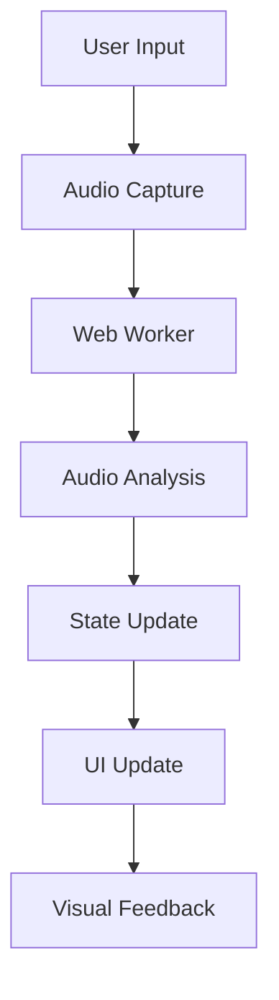

# Documentação Técnica - VocalCoach AI

## Arquitetura

### Frontend

O frontend é construído com React e TypeScript, seguindo uma arquitetura baseada em componentes. A estrutura principal inclui:

#### Componentes Core

1. **VoiceAnalysis**
   - `VoiceCapture`: Gerencia a captura e análise de áudio em tempo real
     - Detecção de silêncio
     - Cálculo de SNR (Signal-to-Noise Ratio)
     - Feedback visual de qualidade
     - Normalização de pitch aprimorada
   - `TimbreVisualizer`: Renderiza visualizações de forma de onda e timbre

2. **VoiceExercise**
   - `ExerciseList`: Lista de exercícios disponíveis
   - `ExerciseGuide`: Guia passo a passo dos exercícios
   - `ExerciseAnimation`: Animações visuais para feedback

#### Páginas

- `Home`: Página inicial com introdução e features
- `Practice`: Interface principal de prática
- `Dashboard`: Visualização de progresso
- `Karaoke`: Modo karaoke (em desenvolvimento)

#### Web Workers

O processamento de áudio é realizado em Web Workers para evitar bloqueio da thread principal:

- `audioAnalyzer.worker.ts`: Análise de áudio em tempo real
  ```typescript
  interface AudioAnalysisResult {
    type: 'result';
    data: {
      pitch: number;      // Frequência normalizada (0-100)
      clarity: number;    // Clareza do sinal (0-100)
      volume: number;     // Volume RMS normalizado (0-100)
      isSilence: boolean; // Indicador de silêncio
      snr: number;       // Signal-to-Noise Ratio em dB
    };
  }
  ```
- `timbreAnalyzer.worker.ts`: Análise específica de timbre

### Análise de Áudio

#### Configurações de Áudio
```typescript
const CONFIG = {
  SILENCE_THRESHOLD: 0.01,  // Limiar para detecção de silêncio
  MIN_PITCH: 50,           // Frequência mínima (Hz)
  MAX_PITCH: 1500,         // Frequência máxima (Hz)
  NOISE_FLOOR: 0.1         // Nível base de ruído
};
```

#### Processamento de Áudio

1. **Detecção de Silêncio**
   - Utiliza RMS (Root Mean Square) para cálculo preciso de volume
   - Threshold adaptativo para diferentes ambientes

2. **Cálculo de SNR**
   - Análise dos primeiros 100ms como ruído de fundo
   - Cálculo logarítmico da relação sinal-ruído
   - Feedback visual da qualidade do sinal

3. **Normalização de Pitch**
   - Escala logarítmica para melhor distribuição
   - Limites de frequência configuráveis
   - Filtragem de valores inválidos

4. **Feedback Visual**
   - Indicadores de qualidade em tempo real
   - Visualização de forma de onda adaptativa
   - Estados visuais para silêncio e ruído

## Interface do Usuário

### Componentes de Feedback

1. **Indicadores de Qualidade**
   ```typescript
   const getSignalQualityColor = (snr: number): string => {
     if (snr > 20) return '#4caf50'; // Bom
     if (snr > 10) return '#ff9800'; // Médio
     return '#f44336'; // Ruim
   };
   ```

2. **Visualização de Áudio**
   - Forma de onda em tempo real
   - Indicadores de volume
   - Estados visuais para diferentes condições

### Estados e Métricas

```typescript
interface AudioMetrics {
  pitch: number;     // Frequência normalizada
  volume: number;    // Volume normalizado
  clarity: number;   // Clareza do sinal
  isSilence: boolean; // Estado de silêncio
  snr: number;      // Relação sinal-ruído
}
```

## Exercícios Vocais

### Estrutura de Dados

```typescript
interface VocalExercise {
  id: string;
  title: string;
  description: string;
  difficulty: 'iniciante' | 'intermediário' | 'avançado';
  duration: number;
  type: 'aquecimento' | 'técnica' | 'respiração' | 'afinação';
  steps: ExerciseStep[];
  tips: string[];
  benefits: string[];
}

interface ExerciseStep {
  id: string;
  instruction: string;
  duration: number;
  targetNote?: string;
  targetPitch?: number;
  animation?: string;
}
```

### Sistema de Animação

Utiliza Framer Motion para animações suaves e responsivas:

```typescript
const animations = {
  breathing: {
    scale: [1, 1.2, 1],
    opacity: [0.7, 1, 0.7],
    transition: {
      duration: 4,
      repeat: Infinity,
      ease: "easeInOut"
    }
  },
  // ... outras animações
};
```

## Estado da Aplicação

### Gerenciamento de Estado

- Estados locais com React Hooks
- Context API para estados globais
- Persistência local para progresso do usuário

### Fluxo de Dados



## Performance

### Otimizações

1. **Web Workers**
   - Processamento de áudio em thread separada
   - Comunicação otimizada com a thread principal

2. **Renderização**
   - Memoização de componentes pesados
   - Lazy loading de rotas
   - Code splitting automático

3. **Áudio**
   - Buffer size otimizado
   - Throttling de atualizações visuais
   - Cleanup adequado de recursos

## Segurança

### Permissões de Áudio

- Solicitação explícita de permissões
- Fallback para navegadores não suportados
- Tratamento seguro de streams de áudio

### Dados do Usuário

- Armazenamento local seguro
- Sanitização de inputs
- Validação de dados

## Testes

### Estratégia de Testes

1. **Testes Unitários**
   - Componentes isolados
   - Funções utilitárias
   - Workers

2. **Testes de Integração**
   - Fluxos de exercícios
   - Análise de áudio
   - Navegação

3. **Testes E2E**
   - Fluxos completos de usuário
   - Compatibilidade cross-browser

### Configuração Pendente

1. **Jest**
   - Configuração de transformers
   - Setup de mocks para Web Audio API
   - Configuração de ambiente

2. **Mocks Necessários**
   ```typescript
   // Mock do Web Audio API
   const mockAudioContext = {
     createMediaStreamSource: jest.fn(),
     createAnalyser: jest.fn(),
     // ... outros métodos
   };

   // Mock dos Web Workers
   class MockWorker {
     onmessage: ((e: MessageEvent) => void) | null = null;
     postMessage(data: any) {
       // Implementação do mock
     }
   }
   ```

3. **Cobertura de Testes**
   - Testes unitários de componentes
   - Testes de integração
   - Testes de performance

## Dependências Principais

```json
{
  "dependencies": {
    "react": "^18.2.0",
    "typescript": "^4.9.5",
    "@mui/material": "^5.14.5",
    "framer-motion": "^10.16.4",
    "web-vitals": "^2.1.4"
  }
}
```

## Próximos Desenvolvimentos

1. **Sistema de Gamificação**
   - Pontuação por exercício
   - Conquistas e níveis
   - Competição social

2. **Análise Avançada**
   - Detecção de vibrato
   - Análise de formantes
   - Reconhecimento de notas

3. **Exercícios Adaptativos**
   - Sistema de dificuldade dinâmica
   - Feedback personalizado
   - Progresso baseado em métricas

4. **Interface Aprimorada**
   - Microinterações
   - Feedback contextual
   - Acessibilidade

## Status Geral do Projeto
- **Estado atual**: Em desenvolvimento
- **Prioridade**: Alta
- **Principais bloqueadores**: Problemas de build e dependências

## 1. Últimas Ações Realizadas

### 1.1 Webpack e Build
```typescript
// Ação:
npm install --save-dev @babel/core babel-loader webpack webpack-cli webpack-dev-server 
html-webpack-plugin @pmmmwh/react-refresh-webpack-plugin --legacy-peer-deps

// Resultado:
- Cache limpo
- Dependências reinstaladas
- 0 vulnerabilidades encontradas
```

### 1.2 Material-UI
```typescript
// Ação:
npm install @mui/material@5.15.11 @mui/icons-material@5.15.11 
@emotion/react@11.11.3 @emotion/styled@11.11.0 @types/material-ui 
--save --legacy-peer-deps

// Resultado:
- Pacotes instalados com sucesso
- 0 vulnerabilidades encontradas
```

### 1.3 Axios
```typescript
// Ação:
npm install axios@1.6.7 @types/axios --save --legacy-peer-deps

// Resultado:
- 1 pacote atualizado
- 1 vulnerabilidade alta identificada
```

## 2. Estado Atual dos Problemas

### 2.1 Webpack
```typescript
// Resolvido:
- Instalação das dependências de desenvolvimento
- Limpeza do cache

// Pendente:
- Verificar se os erros de build foram resolvidos
- Testar compilação do projeto
```

### 2.2 Material-UI
```typescript
// Resolvido:
- Instalação dos pacotes principais
- Instalação das dependências de estilo

// Pendente:
- Verificar se os erros de importação foram resolvidos
- Testar renderização dos ícones
```

### 2.3 Axios
```typescript
// Resolvido:
- Atualização para versão mais recente
- Instalação dos tipos

// Pendente:
- Verificar se o erro de AxiosRequestConfig foi resolvido
- Resolver vulnerabilidade alta identificada
```

## 3. Próximos Passos

1. **Verificação de Build**
   - Testar compilação do projeto
   - Verificar logs de erro
   - Resolver problemas remanescentes

2. **Testes de Componentes**
   - Verificar renderização dos ícones
   - Testar navegação
   - Validar requisições HTTP

3. **Segurança**
   - Resolver vulnerabilidade do Axios
   - Executar npm audit fix
   - Verificar impacto das correções

## 4. Ambiente de Desenvolvimento

```plaintext
Sistema Operacional: Windows 10 (win32 10.0.26100)
Node.js: v22.16.0
Workspace: C:\Cursor\VocalCoach AI
Shell: PowerShell
Porta: 3003

Dependências Principais:
- React: 18.2.0
- React Router: 6.22.1
- Material-UI: 5.15.11
- Axios: 1.6.7
```

## 5. Vulnerabilidades

```plaintext
Identificadas:
- 4 vulnerabilidades moderadas
- 6 vulnerabilidades altas

Ação Necessária:
npm audit fix --force
```

## 6. Erros Atuais

### 6.1 Erros de Compilação React Router
```typescript
// Problema:
Exports não encontrados em react-router-dom:
- Navigate
- useLocation
- useNavigate

// Arquivos Afetados:
1. App.tsx (linha 90)
2. components/Auth/PrivateRoute.tsx (linhas 12, 18, 35)
3. components/Layout/Navbar.tsx (linhas 15, 16, 296)
4. pages/Home.tsx (linhas 16, 1015)

// Exports Disponíveis:
BrowserRouter, Form, HashRouter, Link, NavLink, RouterProvider, ScrollRestoration,
createBrowserRouter, createHashRouter, createSearchParams
```

### 6.2 Erros de Material-UI Icons
```typescript
// Erro:
TS2307: Cannot find module '@mui/icons-material'

// Arquivos Afetados:
1. components/Auth/LoginModal.tsx
2. components/Layout/Footer.tsx
3. components/Layout/Logo.tsx
4. components/Layout/Navbar.tsx
5. pages/Dashboard.tsx
6. pages/Home.tsx
7. pages/Karaoke.tsx
8. pages/Practice.tsx
```

### 6.3 Erros de TypeScript
```typescript
// 1. Erro no Axios:
TS2305: Module '"axios"' has no exported member 'AxiosRequestConfig'
Arquivo: src/services/api.ts

// 2. Erro no Theme:
TS4104: The type 'readonly ["none", string, ...]' is 'readonly'
Arquivo: src/utils/theme.ts
```

### 6.4 Erros de Webpack
```typescript
// Problemas de Módulos:
1. Can't resolve '@pmmmwh/react-refresh-webpack-plugin/client/ReactRefreshEntry.js'
2. Can't resolve 'babel-loader/lib/index.js'
3. Can't resolve 'webpack-dev-server/client/index.js'
4. Can't resolve 'webpack/hot/dev-server.js'
5. Can't resolve 'html-webpack-plugin/lib/loader.js'

// Erro de Cache:
ENOENT: no such file or directory, stat 'node_modules/.cache/default-development/1.pack'
```

### 6.5 Warnings ESLint
```typescript
// Em src/pages/Home.tsx:
1. 'isMobile' não utilizado
2. 'isTablet' não utilizado
3. 'handleDrawerToggle' não utilizado
4. 'drawer' não utilizado
5. useEffect missing dependency: 'features.length'

// Em src/utils/theme.ts:
1. 'glassEffects' não utilizado
```

## 7. Tentativas de Solução

### 7.1 React Router
```typescript
// Última tentativa:
npm install react-router@6.22.1 react-router-dom@6.22.1 @types/react-router-dom@6.22.1 --save --legacy-peer-deps

// Status: Não resolvido
// Próxima ação: Verificar compatibilidade com versão do React
```

### 7.2 Material-UI
```typescript
// Última tentativa:
npm install @mui/material@5.15.11 @mui/icons-material@5.15.11 --save --legacy-peer-deps

// Status: Não resolvido
// Próxima ação: Verificar problemas de tipos TypeScript
```

### 7.3 Webpack
```typescript
// Última tentativa:
npm install --save-dev webpack@5.90.3 webpack-cli@5.1.4 webpack-dev-server@5.0.2 
html-webpack-plugin@5.6.0 babel-loader@9.1.3 @pmmmwh/react-refresh-webpack-plugin@0.5.11 
--legacy-peer-deps

// Status: Parcialmente resolvido
// Problemas pendentes: Módulos não encontrados
```

## 8. Plano de Ação
### 8.1 Prioridades Imediatas
1. Resolver problemas de build (Webpack)
2. Corrigir erros de dependências (React Router, Material-UI)
3. Resolver vulnerabilidades de segurança

### 8.2 Próximos Passos
1. **Resolver Problemas de Build**
   - Limpar cache do webpack
   - Reinstalar dependências do babel
   - Verificar configuração do webpack

2. **Corrigir Tipos TypeScript**
   - Atualizar @types/axios
   - Resolver problema de readonly no tema
   - Verificar tipos do Material-UI

3. **Resolver React Router**
   - Testar versão anterior do react-router-dom
   - Verificar compatibilidade com React 18
   - Atualizar imports para nova API

4. **Resolver Material-UI**
   - Verificar instalação dos tipos
   - Resolver problemas de importação de ícones
   - Atualizar imports para nova sintaxe

## 9. Ambiente de Desenvolvimento

```plaintext
Sistema Operacional: Windows 10 (win32 10.0.26100)
Node.js: v22.16.0
Workspace: C:\Cursor\VocalCoach AI
Shell: PowerShell
Porta: 3003

Navegadores Suportados:
- Chrome (última versão)
- Firefox (última versão)
- Edge (última versão)
```

## 10. Estrutura do Projeto

```plaintext
VocalCoach AI/
├── backend/          # API e lógica do servidor
├── src/
│   ├── components/   # Componentes React reutilizáveis
│   ├── pages/        # Páginas da aplicação
│   ├── services/     # Serviços e APIs
│   └── utils/        # Utilitários e helpers
└── public/           # Arquivos estáticos
```

## 11. Próximos Passos

1. **Correção de Dependências**
   - Resolver conflitos de versão do React Router
   - Corrigir importações do Material-UI
   - Atualizar configuração do Webpack

2. **Melhorias de Performance**
   - Otimizar carregamento de ícones
   - Implementar lazy loading
   - Reduzir bundle size

3. **Correções de TypeScript**
   - Resolver tipos do Axios
   - Corrigir tipos readonly no tema
   - Atualizar tipos do Material-UI

4. **Limpeza de Código**
   - Remover variáveis não utilizadas
   - Corrigir dependências do useEffect
   - Atualizar imports obsoletos 