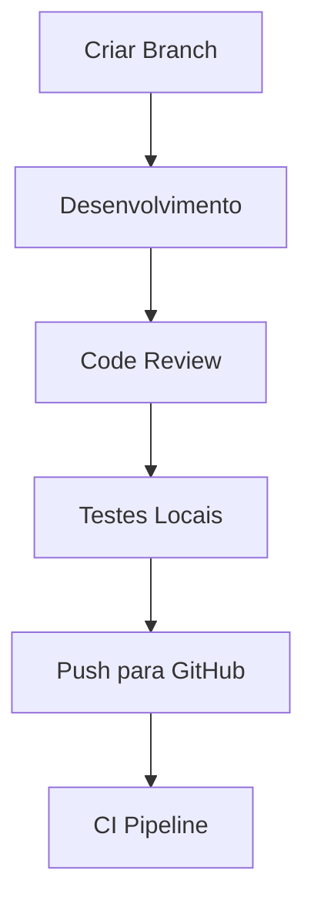
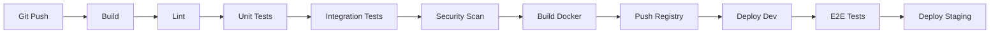
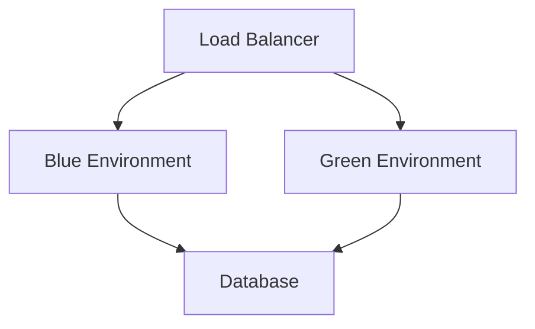
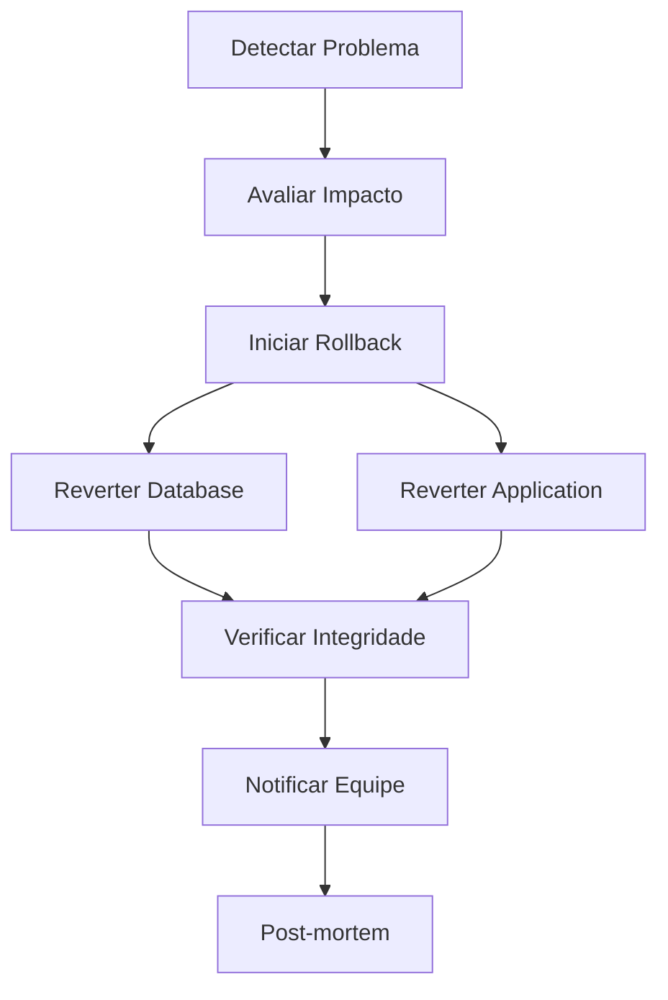

# 🚀 Guia de Deployment

## 📋 Visão Geral
Este guia detalha os procedimentos, requisitos e melhores práticas para o deployment do VocalCoach AI. O processo é automatizado através de CI/CD, com suporte para múltiplos ambientes e estratégias de rollback.

## 🎯 Objetivos
- Garantir deployments seguros e consistentes
- Minimizar downtime
- Manter qualidade e performance
- Facilitar rollbacks quando necessário
- Automatizar processos repetitivos

## 🌐 Ambientes

### Development (dev)
- **URL**: https://dev.vocalcoach.ai
- **Propósito**: Desenvolvimento e testes iniciais
- **Atualização**: Automática a cada push na branch `develop`
- **Dados**: Subset de produção + dados de teste
- **Acesso**: Apenas equipe de desenvolvimento

### Staging (stg)
- **URL**: https://staging.vocalcoach.ai
- **Propósito**: Testes de integração e QA
- **Atualização**: Manual após aprovação
- **Dados**: Clone parcial de produção
- **Acesso**: Equipe interna + beta testers selecionados

### Production (prod)
- **URL**: https://vocalcoach.ai
- **Propósito**: Ambiente de produção
- **Atualização**: Manual após aprovação completa
- **Dados**: Dados reais de produção
- **Acesso**: Público + beta testers

## 🔄 Processo de Deployment

### 1. Preparação


#### Checklist Pré-Deploy
- [ ] Todos os testes passando
- [ ] Code review aprovado
- [ ] Documentação atualizada
- [ ] Dependências verificadas
- [ ] Migrations preparadas
- [ ] Variáveis de ambiente configuradas
- [ ] Backup realizado

### 2. CI/CD Pipeline


#### Estágios do Pipeline
1. **Build**
   - Compilação do código
   - Verificação de sintaxe
   - Análise estática

2. **Testes**
   - Testes unitários
   - Testes de integração
   - Testes E2E
   - Testes de performance

3. **Segurança**
   - Análise de dependências
   - Scan de vulnerabilidades
   - Verificação de secrets

4. **Containerização**
   - Build de imagens Docker
   - Tag com versão
   - Push para registry

5. **Deployment**
   - Atualização de configs
   - Deploy de containers
   - Verificação de health

### 3. Estratégia de Deployment

#### Blue-Green Deployment


1. **Preparação**
   - Deploy da nova versão no ambiente inativo
   - Execução de migrations
   - Warm-up de caches

2. **Validação**
   - Health checks
   - Smoke tests
   - Performance checks

3. **Switch**
   - Redirecionamento de tráfego
   - Verificação de métricas
   - Monitoramento de erros

4. **Finalização**
   - Confirmação de estabilidade
   - Cleanup do ambiente antigo
   - Atualização de documentação

### 4. Monitoramento Pós-Deploy

#### Métricas Críticas
- Latência de API
- Taxa de erros
- Uso de recursos
- Throughput
- Adesão de usuários

#### Alertas
- Latência > 500ms
- Error rate > 1%
- CPU > 80%
- Memory > 85%
- Disk usage > 90%

## 🔄 Rollback

### Triggers para Rollback
- Error rate acima do threshold
- Problemas de performance críticos
- Bugs que afetam funcionalidades core
- Problemas de segurança
- Inconsistência de dados

### Processo de Rollback


1. **Rollback Rápido**
   ```bash
   npm run rollback:quick -- --version=<previous-version>
   ```

2. **Rollback Completo**
   ```bash
   npm run rollback:full -- --version=<previous-version> --with-data
   ```

3. **Verificação Pós-Rollback**
   ```bash
   npm run verify:deployment
   ```

## 📦 Gestão de Versões

### Versionamento
- Semantic Versioning (MAJOR.MINOR.PATCH)
- Tags no Git para cada release
- Changelog automático
- Release notes

### Artefatos
- Imagens Docker
- Assets estáticos
- Backups de configuração
- Documentation snapshots

## 🔒 Segurança

### Checklist de Segurança
- [ ] Secrets rotacionados
- [ ] Certificados SSL válidos
- [ ] Firewalls configurados
- [ ] WAF atualizado
- [ ] Security headers
- [ ] Rate limiting
- [ ] DDoS protection

### Gestão de Secrets
- AWS Secrets Manager
- Rotação automática
- Audit logging
- Access control

## 📝 Logs e Auditoria

### Log Aggregation
- ELK Stack
- Log retention
- Log rotation
- Structured logging

### Audit Trail
- Deployment logs
- Access logs
- Change logs
- Security logs

## 🚨 Procedimentos de Emergência

### 1. Problemas de Performance
```bash
# Escalar recursos
npm run scale:resources

# Limpar caches
npm run clear:cache

# Ativar modo de contingência
npm run enable:contingency
```

### 2. Problemas de Dados
```bash
# Restaurar último backup
npm run restore:backup

# Verificar integridade
npm run verify:data

# Sincronizar dados
npm run sync:data
```

### 3. Problemas de Segurança
```bash
# Bloquear acesso
npm run security:lockdown

# Revogar tokens
npm run revoke:tokens

# Atualizar firewalls
npm run update:security
```

## 📊 Métricas de Sucesso

### Deploy Success Rate
- Taxa de sucesso de deploys
- Tempo médio de deploy
- Frequência de rollbacks
- MTTR (Mean Time To Recovery)

### Performance
- Latência pós-deploy
- Uso de recursos
- Cache hit ratio
- Error rates

## 🔄 Processo de Atualização

Este guia deve ser atualizado:
- A cada mudança significativa no processo
- Após lições aprendidas de incidentes
- Quando novas ferramentas são adicionadas
- Durante revisões periódicas

## 📝 Notas Importantes
1. Sempre verificar o checklist pré-deploy
2. Manter documentação atualizada
3. Monitorar métricas pós-deploy
4. Seguir processo de rollback quando necessário
5. Realizar post-mortem após incidentes 