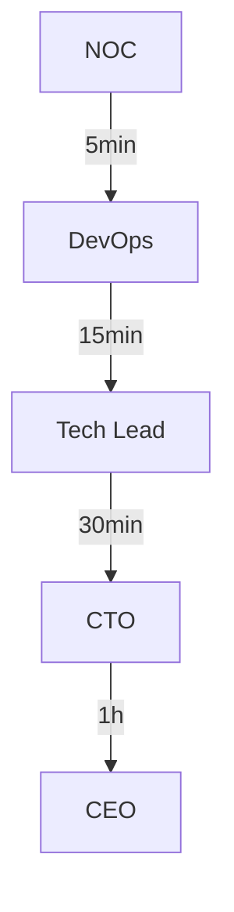
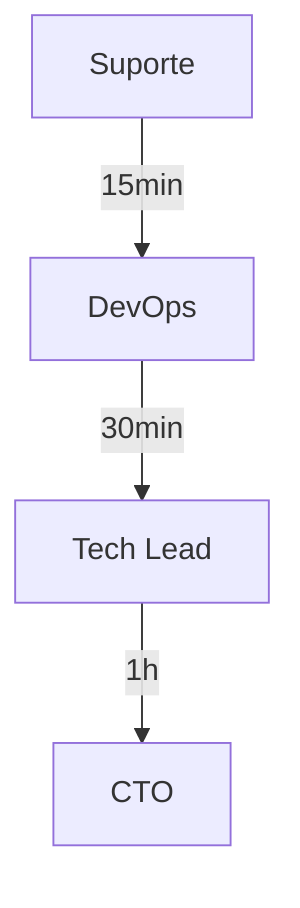
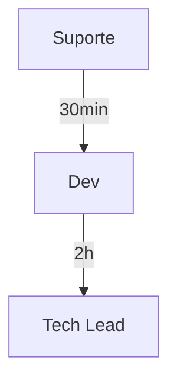
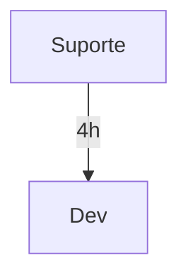

# 📈 Guia de Escalamento - VocalCoach AI Beta

## 📋 Índice
1. [Visão Geral](#visão-geral)
2. [Níveis de Escalamento](#níveis-de-escalamento)
3. [Matriz de Escalação](#matriz-de-escalação)
4. [Procedimentos](#procedimentos)
5. [Comunicação](#comunicação)
6. [Pós-Incidente](#pós-incidente)

## 🎯 Visão Geral

### Objetivos
- Resolução rápida de incidentes
- Envolvimento correto da equipe
- Comunicação eficiente
- Minimização de impacto
- Documentação adequada
- Aprendizado contínuo

### Princípios
- Escalar cedo é melhor que tarde
- Comunicação clara e objetiva
- Documentação em tempo real
- Responsabilidades definidas
- Feedback constante
- Melhoria contínua

## 🔄 Níveis de Escalamento

### Nível 1 - Suporte Inicial
| Responsável | Tempo | Ações | Limites |
|-------------|-------|--------|---------|
| Suporte | 15min | Troubleshooting básico | Problemas simples |
| Beta CM | 30min | Comunicação usuários | Updates status |
| NOC | 24/7 | Monitoramento | Alertas básicos |

### Nível 2 - Técnico
| Responsável | Tempo | Ações | Limites |
|-------------|-------|--------|---------|
| DevOps | 30min | Infraestrutura | Performance |
| Dev | 1h | Código/Bugs | Features |
| DBA | 1h | Banco de dados | Queries |

### Nível 3 - Especialista
| Responsável | Tempo | Ações | Limites |
|-------------|-------|--------|---------|
| Tech Lead | 1h | Arquitetura | Design |
| Security | 30min | Segurança | Violações |
| SRE | 1h | Reliability | Estabilidade |

### Nível 4 - Gestão
| Responsável | Tempo | Ações | Limites |
|-------------|-------|--------|---------|
| CTO | 2h | Decisões técnicas | Estratégia |
| CEO | 4h | Decisões negócio | Impacto |
| Legal | 4h | Compliance | Regulações |

## 📊 Matriz de Escalação

### P1 - Crítico


### P2 - Alto


### P3 - Médio


### P4 - Baixo


## 📝 Procedimentos

### 1. Identificação
- Avaliar severidade
- Determinar impacto
- Verificar escopo
- Identificar responsáveis
- Iniciar documentação

### 2. Notificação
- Contatar nível apropriado
- Fornecer contexto
- Confirmar recebimento
- Acompanhar resposta
- Atualizar status

### 3. Acompanhamento
- Monitorar progresso
- Atualizar stakeholders
- Documentar ações
- Verificar efetividade
- Ajustar escalação

### 4. Resolução
- Confirmar solução
- Validar resultados
- Notificar envolvidos
- Atualizar documentação
- Coletar feedback

## 📱 Comunicação

### Canais por Nível
| Nível | Principal | Backup | Emergência |
|-------|-----------|--------|------------|
| N1 | Discord | Email | - |
| N2 | Discord | Slack | SMS |
| N3 | Slack | Telefone | SMS |
| N4 | Telefone | SMS | WhatsApp |

### Templates de Escalação

#### Escalação Inicial
```
🔄 ESCALAÇÃO NECESSÁRIA

Incidente: [ID/Descrição]
Nível Atual: [N1/N2/N3/N4]
Motivo: [Razão da escalação]
Tentativas: [Ações já realizadas]
Impacto: [Usuários/Sistemas afetados]
```

#### Update de Status
```
📊 UPDATE DE ESCALAÇÃO

ID: [Número]
Status: [Em progresso/Bloqueado]
Ações: [Medidas tomadas]
Próximos passos: [Planejamento]
ETA: [Tempo estimado]
```

#### Resolução
```
✅ ESCALAÇÃO RESOLVIDA

ID: [Número]
Solução: [Descrição]
Impacto final: [Avaliação]
Lições: [Aprendizados]
Prevenção: [Medidas futuras]
```

## 📊 Métricas de Escalação

### KPIs
| Métrica | Meta | Warning | Crítico |
|---------|------|---------|----------|
| MTTR | < 1h | 1-4h | > 4h |
| MTTE | < 15min | 15-30min | > 30min |
| Taxa de Sucesso | > 90% | 80-90% | < 80% |
| Satisfação | > 4.5/5 | 3.5-4.5 | < 3.5 |

### Monitoramento
- Tempo de resposta
- Efetividade
- Satisfação
- Recorrência
- Prevenção

## 📑 Pós-Incidente

### Análise
1. Coletar dados
2. Identificar causa raiz
3. Avaliar impacto
4. Documentar timeline
5. Propor melhorias

### Documentação
- Post-mortem
- Lições aprendidas
- Atualizações de processo
- Medidas preventivas
- Treinamentos necessários

### Melhorias
- Atualizar procedimentos
- Ajustar thresholds
- Revisar escalações
- Treinar equipe
- Implementar prevenções

## 📞 Contatos de Emergência

### Equipe Principal
| Função | Contato | Disponibilidade |
|--------|---------|----------------|
| NOC | @noc | 24/7 |
| DevOps | @devops | 24/7 |
| Tech Lead | @techlead | 8h-20h |
| CTO | @cto | On-call |

### Equipe de Suporte
| Função | Contato | Horário |
|--------|---------|---------|
| Beta CM | @cm | 9h-18h |
| Suporte N1 | @support | 24/7 |
| Suporte N2 | @support2 | 8h-20h |
| QA | @qa | 9h-18h |

## 📝 Notas Importantes
- Documentar todas as ações
- Manter comunicação clara
- Respeitar SLAs
- Atualizar status regularmente
- Coletar feedback
- Melhorar continuamente 