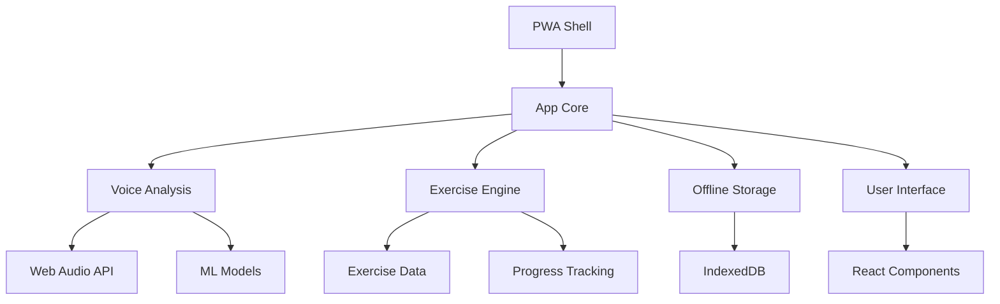
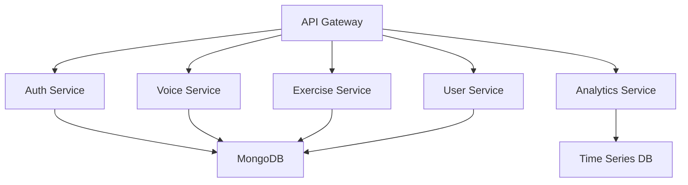
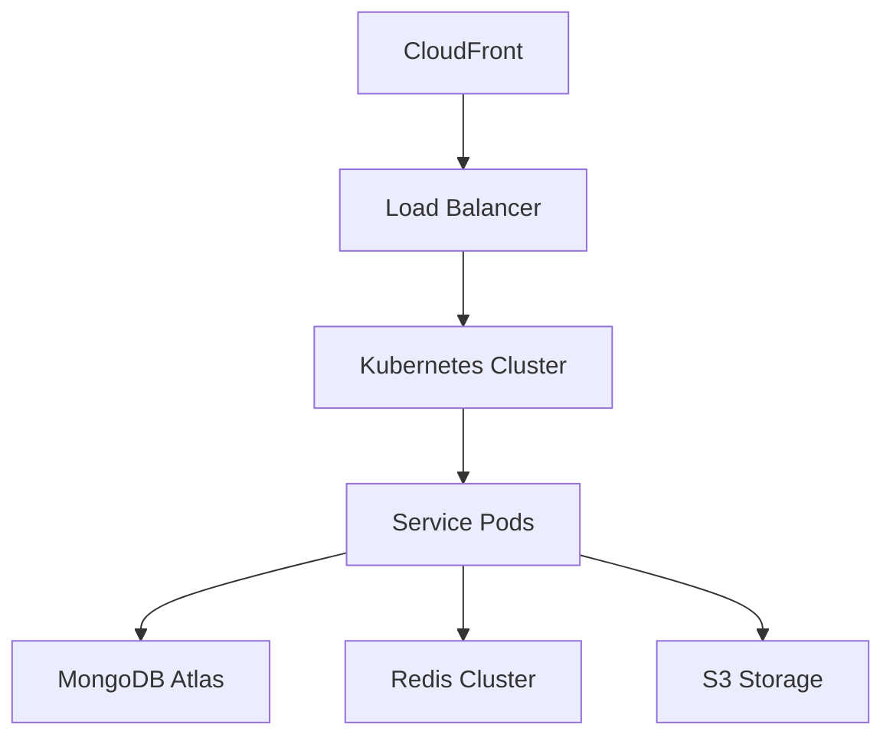
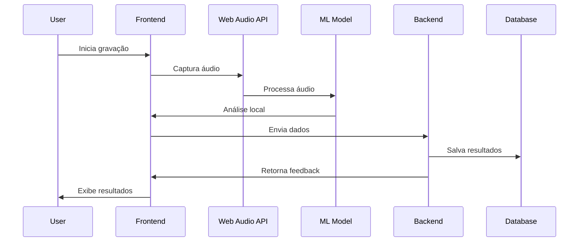
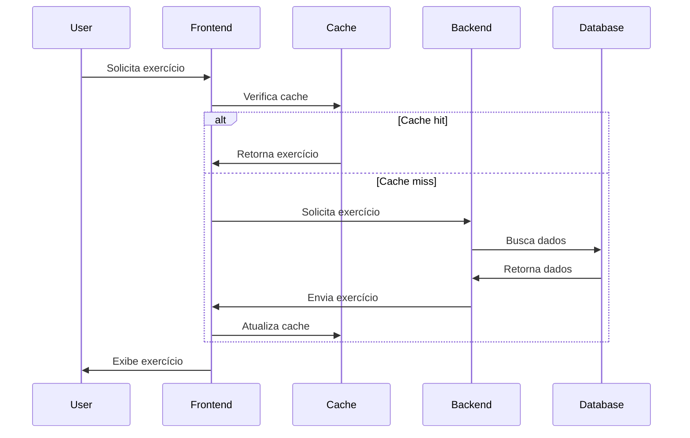
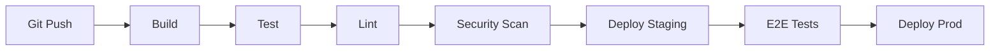

# 🏗️ Arquitetura do Sistema

## 📋 Visão Geral
O VocalCoach AI é uma aplicação web progressiva (PWA) que utiliza tecnologias modernas para fornecer análise de voz em tempo real e exercícios personalizados. A arquitetura é baseada em microsserviços, com foco em escalabilidade, performance e experiência offline.

## 🎯 Objetivos Arquiteturais
- Alta disponibilidade (99.9%)
- Baixa latência (<100ms para análise de voz)
- Suporte offline
- Escalabilidade horizontal
- Segurança e privacidade dos dados
- Manutenibilidade e testabilidade

## 🔧 Stack Tecnológico

### Frontend
- **Framework Principal**: React 18
- **Linguagem**: TypeScript 5.0
- **State Management**: Redux Toolkit
- **UI/Components**: Material-UI v5
- **PWA**: Workbox
- **Audio Processing**: Web Audio API
- **Machine Learning**: TensorFlow.js
- **Testing**: Jest + React Testing Library
- **Build Tool**: Webpack 5

### Backend
- **Runtime**: Node.js 18
- **Framework**: Express.js
- **Linguagem**: TypeScript 5.0
- **Database**: MongoDB 6.0
- **Cache**: Redis 7.0
- **Authentication**: Passport.js + JWT
- **API Documentation**: Swagger/OpenAPI
- **Testing**: Jest + Supertest

### DevOps
- **CI/CD**: GitHub Actions
- **Containerization**: Docker
- **Container Orchestration**: Kubernetes
- **Monitoring**: Grafana + Prometheus
- **Logging**: ELK Stack
- **Cloud Provider**: AWS
- **CDN**: CloudFront
- **SSL/TLS**: Let's Encrypt

## 🏛️ Componentes Principais

### 1. Frontend (PWA)

#### Componentes Principais
- **PWA Shell**: Gerenciamento de service workers e cache
- **Voice Analysis**: Processamento e análise de áudio em tempo real
- **Exercise Engine**: Motor de exercícios e gamificação
- **Offline Storage**: Gerenciamento de dados offline
- **User Interface**: Componentes de UI e interação

### 2. Backend (Microservices)

#### Serviços
- **API Gateway**: Roteamento e load balancing
- **Auth Service**: Autenticação e autorização
- **Voice Service**: Análise de voz e feedback
- **Exercise Service**: Gerenciamento de exercícios
- **User Service**: Gestão de usuários e progresso
- **Analytics Service**: Métricas e análises

### 3. Infraestrutura

## 📊 Fluxo de Dados

### 1. Análise de Voz

### 2. Exercícios

## 🔒 Segurança

### Autenticação
- JWT (Access + Refresh Tokens)
- OAuth 2.0 para login social
- 2FA opcional
- Rate limiting
- CORS configurado

### Dados
- Encryption at rest (AES-256)
- SSL/TLS em todas as conexões
- Dados sensíveis em vault
- Backup automático
- Sanitização de inputs

### Infraestrutura
- VPC configurada
- Security groups
- WAF habilitado
- DDoS protection
- Regular security scans

## 📈 Escalabilidade

### Horizontal Scaling
- Kubernetes auto-scaling
- Database sharding
- Redis cluster
- CDN para assets

### Vertical Scaling
- Optimized instance types
- Memory/CPU monitoring
- Database indexing
- Query optimization

## 🔄 Cache Strategy

### Frontend
- Service Worker cache
- Runtime caching
- IndexedDB para offline
- Memory cache para ML models

### Backend
- Redis para sessões
- Query cache
- API response cache
- Asset cache

## 📊 Monitoramento

### Métricas
- Latência de API
- CPU/Memory usage
- Error rates
- User engagement
- Cache hit rates

### Logging
- Structured logging
- Log aggregation
- Error tracking
- Performance tracing
- Audit logs

## 🔧 DevOps

### CI/CD Pipeline

### Deployment Strategy
- Blue-Green deployment
- Canary releases
- Feature flags
- Rollback capability
- Zero-downtime updates

## 📝 Decisões Arquiteturais

### PWA
- **Decisão**: Implementar como PWA
- **Razão**: Suporte offline, melhor UX
- **Alternativas**: Native app, web only
- **Consequências**: Complexidade adicional

### Microsserviços
- **Decisão**: Arquitetura de microsserviços
- **Razão**: Escalabilidade, manutenibilidade
- **Alternativas**: Monolito
- **Consequências**: Overhead de operações

### ML no Cliente
- **Decisão**: TensorFlow.js no frontend
- **Razão**: Baixa latência, privacidade
- **Alternativas**: ML no backend
- **Consequências**: Maior uso de recursos do cliente

## 🔄 Processo de Atualização

Esta documentação deve ser atualizada:
- A cada release major
- Quando houver mudanças arquiteturais
- Durante revisões técnicas
- Após decisões arquiteturais significativas

## 📝 Notas Importantes
1. Manter diagramas atualizados
2. Documentar decisões arquiteturais
3. Revisar métricas periodicamente
4. Atualizar dependências regularmente
5. Manter backlog técnico 